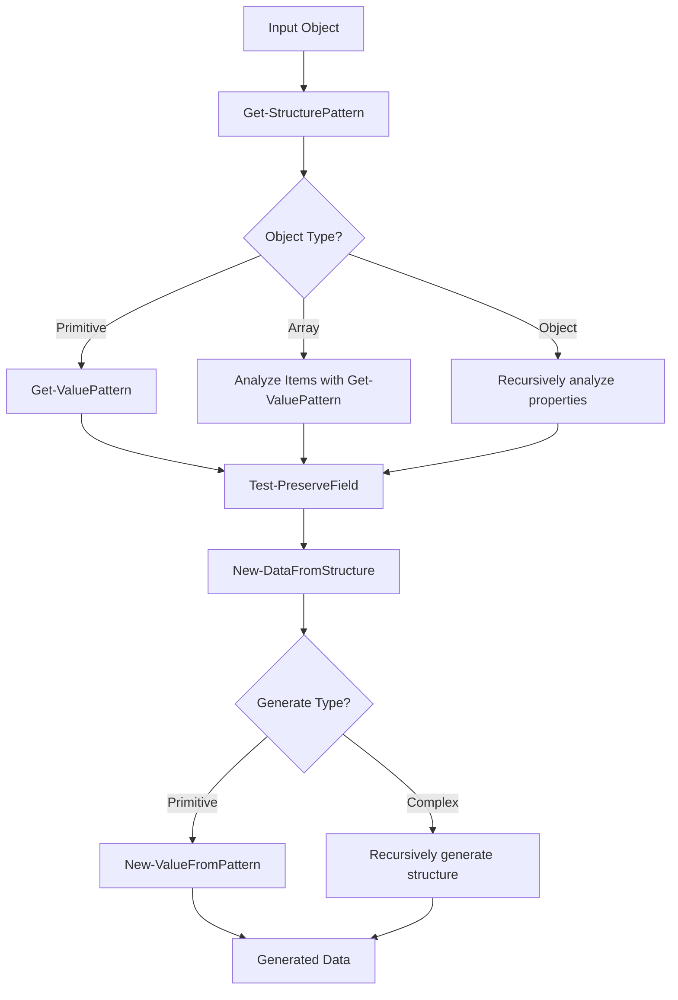

# PSTestableData Utility Functions Documentation

## Overview

The PSTestableData module includes several utility functions that work together to analyze structured data patterns and generate realistic synthetic data. These functions were extracted from the original `New-StructuredDataFromSample` function to improve modularity, testability, and maintainability.

## Architecture

The utility functions follow a clear separation of concerns:

1. **Pattern Analysis**: `Get-ValuePattern` and `Get-StructurePattern` analyze input data
2. **Field Management**: `Test-PreserveField` handles selective field preservation
3. **Data Generation**: `New-ValueFromPattern` and `New-DataFromStructure` create new data

## Function Reference

### Get-ValuePattern

**Purpose**: Analyzes individual values to determine their data type and format pattern.

**Signature**:
```powershell
Function Get-ValuePattern {
    [CmdletBinding()]
    [OutputType([hashtable])]
    Param(
        [object]$Value
    )
}
```

**Parameters**:
- `$Value` - The individual value to analyze (can be any type)

**Returns**: A hashtable containing:
- `Type` - The primary data type ('null', 'string', 'int', 'long', 'double', 'bool', 'datetime', 'guid', 'object')
- `Pattern` - The specific pattern identifier
- Additional properties based on type (Length, Range, etc.)

**Pattern Recognition**:

| Pattern | Regex | Example | Return Value |
|---------|--------|---------|--------------|
| ISO8601 DateTime | `^\d{4}-\d{2}-\d{2}T\d{2}:\d{2}:\d{2}` | `2023-10-01T12:00:00Z` | `{Type='datetime'; Pattern='iso8601'}` |
| GUID | `^[0-9a-f]{8}-[0-9a-f]{4}-[0-9a-f]{4}-[0-9a-f]{4}-[0-9a-f]{12}$` | `123e4567-e89b-12d3-a456-426614174000` | `{Type='guid'; Pattern='guid'}` |
| Numeric String | `^\d+$` | `12345` | `{Type='string'; Pattern='numeric'}` |
| Kebab-case | `^[a-zA-Z]+(-[a-zA-Z]+)+$` | `hello-world-test` | `{Type='string'; Pattern='kebab-case'}` |
| Dotted Notation | `^[a-zA-Z]+\.[a-zA-Z]+` | `kubernetes.io/metadata` | `{Type='string'; Pattern='dotted'}` |
| Text | Any other string | `Hello World` | `{Type='string'; Pattern='text'; Length=11}` |

**Numeric Range Detection**:
- **Int32**: Creates range of ±100 around the input value
- **Int64**: Creates range of ±1000 around the input value
- Handles array inputs by using the first element
- Provides fallback ranges for conversion errors

**Usage Examples**:
```powershell
# String pattern recognition
$pattern = Get-ValuePattern -Value "2023-10-01T12:00:00Z"
# Returns: @{Type='datetime'; Pattern='iso8601'}

# Numeric range detection
$pattern = Get-ValuePattern -Value 42
# Returns: @{Type='int'; Pattern='number'; Range=@(-58, 142)}

# Text with length
$pattern = Get-ValuePattern -Value "Hello World"
# Returns: @{Type='string'; Pattern='text'; Length=11}
```

---

### Test-PreserveField

**Purpose**: Determines whether a specific field path should be preserved from anonymization based on pattern matching.

**Signature**:
```powershell
Function Test-PreserveField {
    [CmdletBinding()]
    [OutputType([bool])]
    Param(
        [string]$FieldPath,
        [string[]]$PreservePatterns
    )
}
```

**Parameters**:
- `$FieldPath` - The hierarchical path to the field (e.g., "metadata.labels.app")
- `$PreservePatterns` - Array of patterns that should be preserved (supports wildcards)

**Pattern Matching**:
- Uses PowerShell's `-like` operator for wildcard matching
- Falls back to exact string matching for invalid wildcard patterns
- Returns `$true` if any pattern matches, `$false` otherwise

**Supported Wildcard Patterns**:
- `*` - Matches any number of characters
- `?` - Matches any single character
- `[abc]` - Matches any character in the set
- `*.phase` - Matches any field ending with ".phase"
- `metadata.*` - Matches any field starting with "metadata."

**Usage Examples**:
```powershell
# Exact match
$result = Test-PreserveField -FieldPath 'apiVersion' -PreservePatterns @('apiVersion', 'kind')
# Returns: $true

# Wildcard match
$result = Test-PreserveField -FieldPath 'metadata.labels.app' -PreservePatterns @('metadata.labels.*')
# Returns: $true

# No match
$result = Test-PreserveField -FieldPath 'data.value' -PreservePatterns @('apiVersion', 'kind')
# Returns: $false
```

**Error Handling**:
- Gracefully handles invalid wildcard patterns
- Falls back to exact string matching when wildcard evaluation fails
- Never throws exceptions, always returns a boolean

---

### Get-StructurePattern

**Purpose**: Recursively analyzes complex data structures to identify their hierarchical patterns, types, and relationships.

**Signature**:
```powershell
Function Get-StructurePattern {
    [CmdletBinding()]
    [OutputType([hashtable])]
    Param(
        [object]$Object,
        [int]$Depth = 0,
        [int]$MaxDepth = 10,
        [string]$FieldPath = ""
    )
}
```

**Parameters**:
- `$Object` - The object to analyze (can be any type)
- `$Depth` - Current recursion depth (internal use)
- `$MaxDepth` - Maximum recursion depth to prevent infinite loops
- `$FieldPath` - Current field path for preservation tracking (internal use)

**Return Structure**:

For **Objects** (hashtables/PSCustomObjects):
```powershell
@{
    Type = 'object'
    ObjectType = 'hashtable' | 'pscustomobject'
    Properties = @{
        # Recursive patterns for each property
    }
}
```

For **Arrays**:
```powershell
@{
    Type = 'array'
    ItemCount = 5           # Original array size
    ItemPatterns = @(...)   # Patterns of first 3 items (performance optimization)
    SampleSize = 3          # Number of items analyzed
}
```

For **Primitives**:
```powershell
@{
    Type = '...'           # From Get-ValuePattern
    Pattern = '...'        # From Get-ValuePattern
    PreserveField = $true  # Whether field should be preserved
    # Additional properties based on type
}
```

**Performance Optimizations**:
- **Array Limiting**: Only analyzes first 3 array items to prevent excessive processing
- **Depth Limiting**: Prevents infinite recursion with configurable maximum depth
- **Early Returns**: Handles null objects immediately

**Field Path Building**:
- Builds hierarchical field paths during recursion
- Paths used for preservation pattern matching
- Format: `"parent.child.grandchild"` for objects, `"parent[]"` for array items

**Usage Examples**:
```powershell
# Simple object analysis
$obj = @{name = 'John'; age = 30; active = $true}
$pattern = Get-StructurePattern -Object $obj
# Returns object pattern with 3 properties analyzed

# Nested structure analysis
$complex = @{
    user = @{
        profile = @{name = 'Test'}
        contacts = @('email1', 'email2')
    }
}
$pattern = Get-StructurePattern -Object $complex
# Returns deeply nested structure pattern

# Array analysis with large dataset
$largeArray = 1..100
$pattern = Get-StructurePattern -Object $largeArray
# Only analyzes first 3 items for performance
```

**Recursion Safety**:
- Automatic depth limiting prevents stack overflow
- Returns fallback pattern when maximum depth exceeded
- Handles circular references gracefully

---

### New-ValueFromPattern

**Purpose**: Generates new values based on analyzed patterns, maintaining format and type consistency while providing variation.

**Signature**:
```powershell
Function New-ValueFromPattern {
    [CmdletBinding()]
    [OutputType([object])]
    Param(
        [hashtable]$Pattern
    )
}
```

**Parameters**:
- `$Pattern` - Pattern hashtable from `Get-ValuePattern` containing generation instructions

**Generation Strategies**:

| Type | Strategy | Example Output |
|------|----------|----------------|
| `null` | Return `$null` | `$null` |
| `datetime` (iso8601) | Random date ±365 days | `2023-09-15T08:30:45Z` |
| `guid` | Generate new GUID | `f47ac10b-58cc-4372-a567-0e02b2c3d479` |
| `string` (numeric) | Random 7-8 digit number | `"1234567"` |
| `string` (kebab-case) | Combine random words | `"active-pending"` |
| `string` (dotted) | Mix prefix/suffix arrays | `"kubernetes.io/metadata.name"` |
| `string` (text) | Select from word dictionary | `"sample"` |
| `int` | Random within range or default | `42` |
| `long` | Random within range or default | `123456` |
| `double` | Random 0.1-99.9 | `45.67` |
| `bool` | Random true/false | `$true` |

**Word Dictionaries**:

**Kebab-case words**: `'active', 'ready', 'pending', 'complete', 'failed', 'running', 'stopped'`

**Dotted notation arrays**:
- **Prefixes**: `'kubernetes.io', 'app.kubernetes', 'service.mesh', 'metadata.k8s', 'config.example', 'system.core', 'runtime.api', 'network.fabric'`
- **Suffixes**: `'metadata.name', 'metadata.labels', 'config.data', 'service.port', 'resource.type', 'status.phase', 'spec.selector', 'policy.rules'`

**Text words**: `'sample', 'test', 'demo', 'example', 'data', 'value', 'item', 'content'`

**Randomization**:
- Uses `$script:customRandom` (.NET System.Random) for consistent quality
- Each function call initializes its own random instance
- Provides better variety than PowerShell's native Get-Random

**Range Handling**:
- Respects range constraints from pattern analysis
- Falls back to sensible defaults when no range specified
- Handles both inclusive and exclusive ranges correctly

**Usage Examples**:
```powershell
# Generate from datetime pattern
$pattern = @{Type='datetime'; Pattern='iso8601'}
$value = New-ValueFromPattern -Pattern $pattern
# Returns: "2023-08-22T14:25:31Z" (random date)

# Generate from integer with range
$pattern = @{Type='int'; Range=@(10, 50)}
$value = New-ValueFromPattern -Pattern $pattern
# Returns: 27 (random integer between 10-49)

# Generate dotted notation
$pattern = @{Type='string'; Pattern='dotted'}
$value = New-ValueFromPattern -Pattern $pattern
# Returns: "kubernetes.io/status.phase" (random combination)
```

---

### New-DataFromStructure

**Purpose**: Recursively generates complete data structures based on analyzed patterns, maintaining structural integrity while providing realistic variation.

**Signature**:
```powershell
Function New-DataFromStructure {
    [CmdletBinding()]
    [OutputType([object])]
    Param(
        [hashtable]$Pattern,
        [int]$Depth = 0,
        [int]$MaxDepth = 10,
        [string]$FieldPath = ""
    )
}
```

**Parameters**:
- `$Pattern` - Structure pattern from `Get-StructurePattern`
- `$Depth` - Current recursion depth (internal use)
- `$MaxDepth` - Maximum recursion depth for safety
- `$FieldPath` - Current field path (internal use)

**Generation Logic**:

**Array Generation**:
1. Handle empty arrays specially (return properly typed empty array)
2. Generate random size between 1 and `$MaxArrayItems`
3. Use item patterns cyclically if fewer patterns than items needed
4. Convert ArrayList to `[object[]]` to prevent unwrapping
5. Apply `@()` wrapping in property assignment contexts

**Object Generation**:

*Hashtables*:
- Create empty hashtable
- Iterate through all properties from pattern
- Recursively generate values for nested objects/arrays
- Apply array wrapping for array properties
- Direct assignment for primitive properties

*PSCustomObjects*:
- Create empty PSCustomObject
- Use `Add-Member` to add each property
- Handle array properties with special wrapping
- Maintain property order and types

**Recursion Management**:
- Tracks depth to prevent infinite loops
- Returns `"max-depth-reached"` fallback at depth limit
- Safely handles circular references and deeply nested structures

**Array Preservation System**:

PowerShell's array unwrapping is prevented through multiple techniques:

1. **ArrayList Building**: Dynamic construction without unwrapping risk
2. **Type Forcing**: `[object[]]$arrayList.ToArray()` ensures array type
3. **Context Wrapping**: `@($value)` in property assignment contexts
4. **Direct Returns**: Avoid pipeline operations that cause unwrapping

**Variable Dependencies**:

The function expects these script-level variables:
- `$script:customRandom` - .NET System.Random instance
- `$script:MaxArrayItems` - Maximum items to generate in arrays

**Usage Examples**:
```powershell
# Generate from simple object pattern
$pattern = @{
    Type = 'object'
    ObjectType = 'hashtable'
    Properties = @{
        name = @{Type='string'; Pattern='text'; Length=5}
        count = @{Type='int'; Range=@(1,10)}
    }
}
$result = New-DataFromStructure -Pattern $pattern
# Returns: @{name='sample'; count=7}

# Generate from array pattern
$pattern = @{
    Type = 'array'
    ItemCount = 3
    ItemPatterns = @(@{Type='string'; Pattern='text'; Length=4})
}
$result = New-DataFromStructure -Pattern $pattern
# Returns: @('test', 'demo', 'data') (random size/content)

# Generate from nested structure
$pattern = @{
    Type = 'object'
    ObjectType = 'pscustomobject'
    Properties = @{
        metadata = @{
            Type = 'object'
            ObjectType = 'hashtable'
            Properties = @{
                name = @{Type='string'; Pattern='text'; Length=6}
            }
        }
        items = @{
            Type = 'array'
            ItemCount = 2
            ItemPatterns = @(@{Type='int'; Range=@(1,100)})
        }
    }
}
$result = New-DataFromStructure -Pattern $pattern
# Returns: [PSCustomObject]@{
#     metadata = @{name='sample'}
#     items = @(42, 78, 23)  # Random size/values
# }
```

**Error Handling**:
- Graceful depth limiting prevents stack overflow
- Handles missing or malformed patterns
- Provides sensible fallbacks for edge cases
- Never throws exceptions during generation

---

## Integration Workflow

The utility functions work together in a coordinated workflow:



## Performance Characteristics

### Time Complexity
- **Get-ValuePattern**: O(1) - Constant time regex matching
- **Test-PreserveField**: O(n) where n = number of preserve patterns
- **Get-StructurePattern**: O(n) where n = total elements, limited by depth and array sampling
- **New-ValueFromPattern**: O(1) - Constant time generation
- **New-DataFromStructure**: O(m) where m = structure size, limited by depth

### Space Complexity
- **Memory Usage**: Linear with respect to input/output size
- **Recursion Stack**: Limited by MaxDepth parameter (default 10)
- **Temporary Objects**: Minimal through efficient ArrayList usage

### Optimization Features
- **Array Sampling**: Only analyzes first 3 array items for large arrays
- **Depth Limiting**: Prevents exponential complexity in deep structures
- **Efficient Randomization**: .NET System.Random for better performance
- **Direct Object Construction**: Minimal copying and temporary object creation

## Testing Coverage

Each utility function has comprehensive test coverage:

- **Get-ValuePattern**: 12 test cases covering all pattern types and edge cases
- **Test-PreserveField**: 7 test cases covering wildcard matching and error handling
- **Get-StructurePattern**: 11 test cases covering all object types and recursion
- **New-ValueFromPattern**: 13 test cases covering all generation strategies
- **New-DataFromStructure**: 12 test cases covering structure generation and array handling
- **Integration Tests**: 3 test cases covering complete workflows

Total: **58 test cases** ensuring reliability and correctness.

## Dependencies

### PowerShell Requirements
- **PowerShell 5.1+**: Core functionality and type system
- **PowerShell 7.x**: Enhanced performance and reliability

### .NET Dependencies
- **System.Random**: High-quality random number generation
- **System.Collections.ArrayList**: Dynamic array construction
- **System.Guid**: GUID generation
- **System.DateTime**: Date manipulation

### Module Dependencies
- Functions work independently but are designed to work together
- No external module dependencies
- Self-contained utility library

## Best Practices

### Usage Guidelines
1. **Initialize Variables**: Ensure `$script:customRandom` and `$script:MaxArrayItems` are set
2. **Handle Depth**: Use appropriate MaxDepth values for your data complexity
3. **Pattern Validation**: Validate pattern structures before passing to generation functions
4. **Error Handling**: Always handle the "max-depth-reached" fallback case

### Performance Tips
1. **Limit Array Analysis**: The 3-item sampling is sufficient for most patterns
2. **Reasonable Depth Limits**: Keep MaxDepth ≤ 20 for most use cases
3. **Batch Generation**: Generate multiple items from the same pattern efficiently
4. **Memory Management**: Clear large pattern objects when no longer needed

### Extensibility
- Functions are designed to be extended with new pattern types
- Pattern hashtable structure can accommodate additional properties
- Generation strategies can be added without breaking existing functionality
- Error handling is robust enough to handle new edge cases

---

*This documentation reflects the current implementation as of October 2025. The utility functions represent a mature, battle-tested foundation for structured data analysis and generation in PowerShell environments.*
